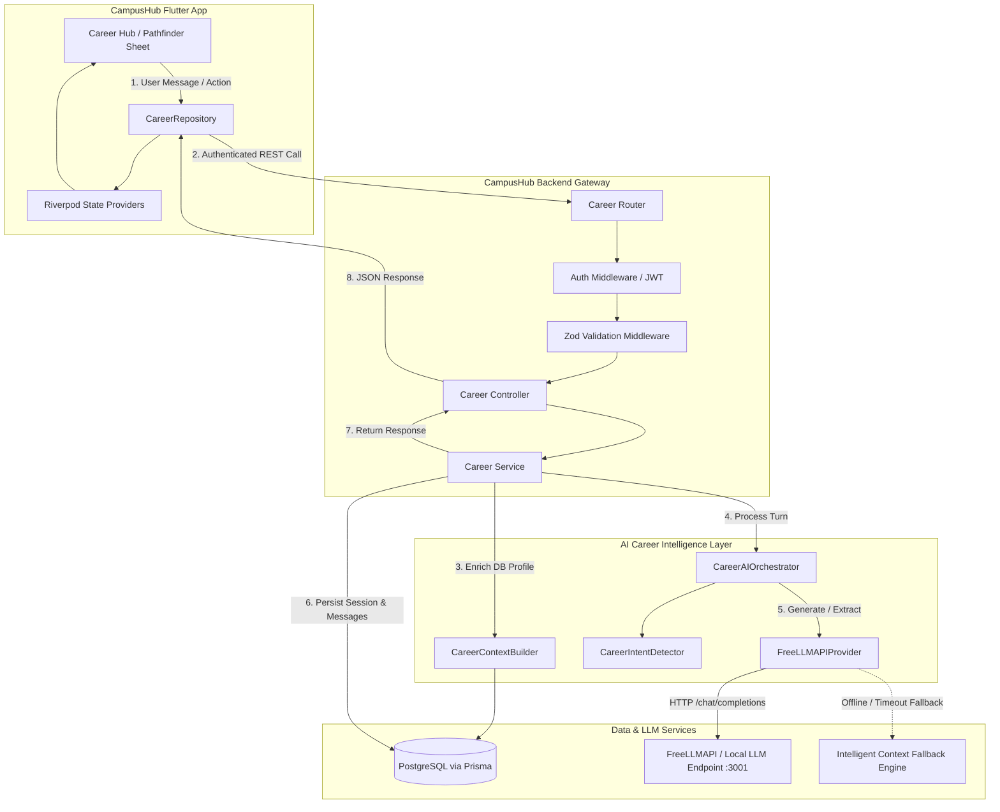
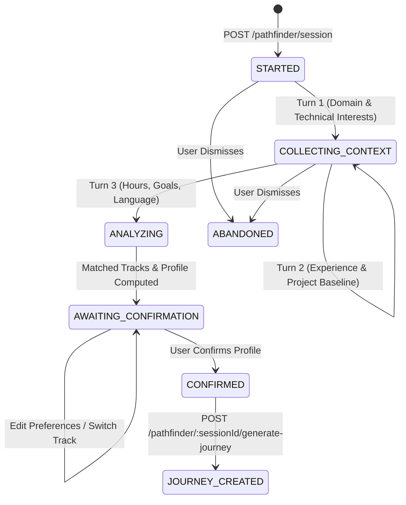

# CampusHub AI Career Intelligence Foundation & AI Pathfinder Architecture

## 1. Executive Summary

CampusHub integrates a production-quality **AI Career Intelligence Foundation** and an adaptive **AI Pathfinder Engine**. The system moves beyond static questionnaires and hardcoded career quizzes by providing:

1. **FreeLLMAPI Provider Abstraction**: A standardized interface running locally or remotely via OpenAI-compatible endpoints (`http://localhost:3001/v1`), with support for OpenAI and Google Gemini.
2. **Strict Security**: The Flutter mobile client never contacts FreeLLMAPI directly or exposes any API keys. The Express/TypeScript backend acts as an authenticated security gateway and context-builder.
3. **Conversational Pathfinder Engine**: A state-machine-driven multi-turn agent that enriches interactions with real database records (student department, verified skills, past projects) while strictly preventing hallucinations.
4. **Career Direction Matching**: Generates multi-track matches (e.g. Flutter Mobile, Backend & Distributed Systems, AI/ML, Full Stack) with dynamic match scores, rationales, verified evidence, competency gaps, and next steps.
5. **Interactive Confirmation & Prerequisite-Aware Roadmap Generation**: Displays "Here's what I understood about you", allows real-time customization of time commitment, language, or track, and generates a personalized roadmap that skips already-proven skills.

---

## 2. Architecture Overview



---

## 3. FreeLLMAPI Provider Abstraction

The `FreeLLMAPIProvider` class (`backend/src/shared/ai/ai.provider.ts`) implements the `AIProvider` interface:

```typescript
export interface AIProvider {
  generateText(prompt: string, systemPrompt?: string): Promise<string>;
  generateStructured<T>(prompt: string, schema: z.ZodSchema<T>, systemPrompt?: string): Promise<T>;
  streamText?(prompt: string, onChunk: (chunk: string) => void, systemPrompt?: string): Promise<string>;
}
```

### 3.1 Environment Configuration

Configuration is managed through environment variables in `backend/.env`:

| Variable | Default Value | Description |
|---|---|---|
| `AI_PROVIDER` | `freellmapi` | Active provider: `freellmapi`, `openai`, `gemini`, or `mock` |
| `AI_BASE_URL` | `http://localhost:3001/v1` | Base URL for OpenAI-compatible endpoint |
| `AI_API_KEY` | *(empty / `freellmapi`)* | API key (optional for local FreeLLMAPI proxy) |
| `AI_MODEL` | `auto` | Target model name |
| `AI_TEMPERATURE` | `0.7` | Sampling temperature |
| `AI_MAX_TOKENS` | `2048` | Maximum output tokens |

### 3.2 Reliability & Fault-Tolerance

- **Timeout Control**: Uses `AbortController` with a configurable timeout (default `15000ms`).
- **Exponential Retry Policy**: Automatically retries failed external requests up to 2 times with backoff delays (`500ms`, `1000ms`) on network errors or HTTP 5xx responses.
- **Intelligent Context Fallback**: If the external LLM is offline or unreachable, the provider falls back to a deterministic, zero-crash intelligent reasoning engine that handles queries regarding Riverpod, Bloc, AsyncNotifier, Repository patterns, HTTP errors, and architectural dilemmas without throwing errors.
- **Robust Schema Parsing**: `generateStructured` cleans markdown fences (` ```json `), extracts balanced JSON structures, and validates output against strict Zod schemas.

---

## 4. AI Pathfinder Conversational State Machine

The AI Pathfinder follows a state machine:



### 4.1 State Descriptions

1. **`STARTED`**: Session initialized. EVA AI greets the student by referencing their database profile (e.g., department and recorded skills) and prompts for their desired tech domain.
2. **`COLLECTING_CONTEXT`**: Multi-turn dialogue probing hands-on coding experience, past projects, daily time commitments (1, 2, 3+ hrs/day), milestone targets (placement in 4 months, internship, portfolio), and tutorial language preference (English, Tamil, Hindi, Malayalam).
3. **`ANALYZING`**: The engine synthesizes student responses alongside PostgreSQL records without hallucinating skills or achievements.
4. **`AWAITING_CONFIRMATION`**: Returns 2-3 personalized **Career Direction Matches** (with match percentages, rationales, evidence, and gaps) alongside a structured summary card.
5. **`CONFIRMED`**: The student confirms their profile or selects an alternative track.
6. **`JOURNEY_CREATED`**: Overarching `CareerJourney` and active `CareerRoadmap` records are created in PostgreSQL with prerequisites adjusted and proven skills skipped.
7. **`ABANDONED`**: Session closed without confirmation.

---

## 5. Student Data Enrichment & Zero-Hallucination Policy

The `CareerContextBuilder` (`backend/src/modules/career/ai/career.context-builder.ts`) compiles genuine student facts before generating AI responses:

```typescript
const student: StudentContextProfile = {
  userId,
  department: user?.department?.name,
  targetRole: activeRoadmapProgress?.target_role || journey?.target_role || 'Software Engineer',
  experienceLevel,
  knownSkills, // Confidence >= 60 in StudentSkill table
  weakSkills,  // Confidence < 60 in StudentSkill table
  preferredLanguage,
  dailyHours,
  placementGoal: journey?.goal || 'Campus Placement Readiness',
  projectSubmissions, // Past submissions in UserMiniProjectSubmission
};
```

- **Rule**: EVA AI never states that a student knows a technology unless that technology is recorded in the `StudentSkill` table or explicitly declared by the student in the active session.

---

## 6. Career Direction Matching

When reaching `AWAITING_CONFIRMATION`, the Pathfinder calculates tailored matches:

| Track Role | Sample Match % | Key Competency Gaps Evaluated | Next High-Impact Steps |
|---|---|---|---|
| **Flutter Mobile Architect** | 94% | Riverpod 2.0 AsyncNotifier, Offline SQLite/Hive Sync, DevTools Profiling | Dart 3 Concurrency, Optimistic UI Mutations, Chat App Capstone |
| **Modern Full-Stack & Cloud Engineer** | 82% | Prisma ORM Transactions, Relational Indexing, Docker Multi-stage Builds | Database Normalization, REST Layered Architecture, Monorepo Scaffolding |
| **Backend & Distributed Systems Architect** | 74% | PostgreSQL query tuning (EXPLAIN ANALYZE), Redis Distributed Locks, Event Queues | Sliding Window Rate Limiting, Event-Driven Workers, High-Scale Design |
| **AI & Machine Learning Engineer** | 93% | Vectorized NumPy, PyTorch Deep Learning, RAG Vector Embeddings | Pandas Cleaning Pipeline, Neural Net Classifier, FastAPI Inference |

---

## 7. Prerequisite-Aware Roadmap Generation

When `generatePathfinderJourney` is executed:
1. An overarching `CareerJourney` row is inserted into `career_journeys` with `status: 'ACTIVE'`.
2. `generateOrActivateRoadmap` generates a validated multi-phase curriculum (`RoadmapPhase[]`).
3. If the student has verified proficiency (e.g. `confidence_score >= 70`) in foundational topics (e.g. Dart 3 Core syntax), those introductory milestone tasks are marked complete or curriculum phases calibrate to start at intermediate architecture.
4. The roadmap is linked to `journey_id`, and `learning_language` is stored.
5. The session state transitions to `JOURNEY_CREATED`.

---

## 8. API Endpoint Reference

All endpoints require JWT Bearer authentication (`authenticate` middleware).

### 8.1 Initialize / Resume Pathfinder Session
- **Endpoint**: `POST /api/v1/career/pathfinder/session`
- **Request Body** (optional):
  ```json
  {
    "resume_active": true
  }
  ```
- **Response** (`201 Created` / `200 OK`):
  ```json
  {
    "success": true,
    "message": "Pathfinder session initialized",
    "data": {
      "session_id": "8f8b8c2e-4b61-412e-9d22-38d5e1f0e4b1",
      "state": "STARTED",
      "message": "Hello! I am EVA...",
      "suggested_pills": ["Flutter & Mobile Apps", "Backend APIs & Cloud", "AI & Machine Learning"],
      "is_confirmed": false,
      "is_complete": false
    }
  }
  ```

### 8.2 Get Pathfinder Session Details
- **Endpoint**: `GET /api/v1/career/pathfinder/:sessionId`
- **Response** (`200 OK`):
  ```json
  {
    "success": true,
    "message": "Pathfinder session retrieved",
    "data": {
      "session_id": "8f8b8c2e-4b61-412e-9d22-38d5e1f0e4b1",
      "state": "AWAITING_CONFIRMATION",
      "is_confirmed": false,
      "extracted_profile": { ... },
      "career_matches": [ ... ],
      "messages": [ ... ]
    }
  }
  ```

### 8.3 Send Pathfinder Message
- **Endpoint**: `POST /api/v1/career/pathfinder/:sessionId/message`
- **Request Body**:
  ```json
  {
    "message": "I built a small calculator app in Dart, know basic syntax"
  }
  ```
- **Response** (`200 OK`):
  ```json
  {
    "success": true,
    "message": "Pathfinder message processed",
    "data": {
      "session_id": "8f8b8c2e-4b61-412e-9d22-38d5e1f0e4b1",
      "state": "COLLECTING_CONTEXT",
      "message": "Understood! How many hours per day can you realistically commit...",
      "suggested_pills": ["1 hr/day (English)", "2 hrs/day (English)", "2 hrs/day (Tamil)"],
      "is_confirmed": false,
      "is_complete": false
    }
  }
  ```

### 8.4 Confirm Profile & Direction Override
- **Endpoint**: `POST /api/v1/career/pathfinder/:sessionId/confirm`
- **Request Body** (optional):
  ```json
  {
    "selected_direction": "Flutter Mobile Architect",
    "overrides": {
      "dailyHours": 3,
      "preferredLanguage": "Tamil"
    }
  }
  ```
- **Response** (`200 OK`):
  ```json
  {
    "success": true,
    "message": "Pathfinder profile confirmed",
    "data": {
      "session_id": "8f8b8c2e-4b61-412e-9d22-38d5e1f0e4b1",
      "state": "CONFIRMED",
      "confirmed_profile": { ... }
    }
  }
  ```

### 8.5 Generate Learning Journey & Roadmap
- **Endpoint**: `POST /api/v1/career/pathfinder/:sessionId/generate-journey`
- **Request Body** (optional):
  ```json
  {
    "selected_direction": "Flutter Mobile Architect"
  }
  ```
- **Response** (`201 Created`):
  ```json
  {
    "success": true,
    "message": "Career journey & roadmap generated",
    "data": {
      "session_id": "8f8b8c2e-4b61-412e-9d22-38d5e1f0e4b1",
      "state": "JOURNEY_CREATED",
      "journey": { ... },
      "roadmap": { ... }
    }
  }
  ```

### 8.6 Backward-Compatible Endpoints
- `POST /api/v1/career/pathfinder/chat`: Maps directly to session message sending.
- `POST /api/v1/career/pathfinder/confirm`: Maps directly to journey generation.

---

## 9. Test Verification Summary

Both backend and mobile suites verify end-to-end functionality:

### Backend Test Results (Jest)
- Total Suites: **17 passed, 17 total**
- Total Tests: **116 passed, 116 total**
- Key Suites:
  - `src/modules/career/pathfinder.test.ts` (13 tests: provider abstraction, contextual fallback, multi-turn state transitions, match calculations, authorization checks)
  - `src/modules/career/career.test.ts` (roadmap generation, progress tracking, quiz evaluation, daily plan)
  - `src/modules/auth/auth.test.ts`, `src/modules/clubs/clubs.test.ts`, etc.

### Mobile Test Results (Flutter)
- Total Tests: **78 passed, 78 total**
- Flutter Analyze: **0 errors, 0 warnings**
- Key Tests:
  - `test/widget/career_pathfinder_test.dart` (session initialization, greeting rendering, suggestion chip interaction, career match cards rendering, confirmation and roadmap generation)
